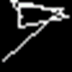

# Generative Adversarial Networks


En intelligence artificielle, les réseaux antagonistes génératifs (RAG) parfois aussi appelés réseaux adverses génératifs (en anglais generative adversarial networks ou GANs) sont une classe d'algorithmes d'apprentissage non supervisé.

# Attention

Si vous télécharger le projet, il faut dézipper le dossier dll et mettre les fichiers dans le dossier du projet.

## Contexte

On nous a demandé de créer une simulation d'un GAN (Generative Adversarial Network) simplifié dans le cadre de l'IA explicable (XAI). Pour ce faire, nous devons utiliser la base de données MNIST de chiffres, créer un générateur de chiffres et utiliser un "discriminateur" pour identifier si les données générées sont des chiffres ou non. Si c'est le cas, nous devons également identifier à quelle classe de chiffres ils appartiennent (par exemple en utilisant un OCR) afin d'agrandir la base de données originale avec des données artificielles


## Dataset MNIST

Le [MNIST](https://www.kaggle.com/datasets/jidhumohan/mnist-png) database (Mixed National Institute of Standards and Technology database) est une base de données de chiffres écrits à la main. Elle est couramment utilisée pour entraîner des systèmes de traitement d'images à la reconnaissance de chiffres. La base de données est aussi largement utilisée pour la formation et le test en matière d'apprentissage en profondeur dans le domaine de l'intelligence artificielle. La base de données MNIST contient 60 000 exemples d'entraînement et 10 000 exemples de test. Les images de la base de données originale ont été normalisées et centrées dans une image de taille fixe (28x28).


## Générateur

Génère une image noire de la taille qu’on veut, ici 28x28 et place de manière aléatoire du bruit sur l’image.
J'ai commencé en générant des images avec des points de manière aléatoire, environ 20% du nombre total de pixels.

  

Toutefois, il est statistiquement peu probable qu'une image générée ressemble de manière vaguement à un chiffre, à moins de corriger les erreurs dans le générateur après avoir soumis l'image au discriminateur (c'est-à-dire lors de l'entraînement d'un réseau de neurones).

J'ai donc décidé de générer les images en utilisant des lignes connectées de manière aléatoire sur l'image. J'ai choisi de sélectionner aléatoirement un nombre compris entre 1 et 5 lignes, car il faut 5 lignes pour représenter un 8 et une seule ligne peut suffire pour un 1.

  

On peut reconnaître assez bien un 1, un 4 et un 7. Cependant, il y a encore beaucoup d'échecs et le discriminateur (que je détaillerai plus loin) arrive encore parfois à lire des chiffres sur des images qui n'ont aucun sens comme (les 3 images sont détectées comme 7).

  

> La prochaine étape consisterai à générer des images avec des courbes et des arrondis.

## Discriminateur

Donne les informations et les probabilités de ce que le discriminateur voit sur l'image. Ici, j'ai utilisé un outil de reconnaissance optique de caractères (OCR) appelé [Tesseract](https://github.com/tesseract-ocr/tesseract), développé par Google et rendu disponible sous licence open source.

En reprenant les images générées précédemment et en utilisant Tesseract, on obtient les résultats suivants :

|       Image        |  |  |  |
| :----------------: | :-----------------------------------: | :-----------------------------------: | :-----------------------------------: |
| **Reconnaissance** |                   1                   |                   5                   |                   7                   |
|  **Probabilité**   |                  24%                  |                  13%                  |                  26%                  |

|       Image        |  |  |  |
| :----------------: | :-----------------------------------: | :-----------------------------------: | :-----------------------------------: |
| **Reconnaissance** |                   1                   |                   4                   |                   7                   |
|  **Probabilité**   |                  85%                  |                  93%                  |                  88%                  |

Avec la 2ème méthode de génération, les probabilités sont nettement meilleures, il est donc possible de prendre en compte ces images pour augmenter la base de données MNIST. Cependant, comme mentionné précédemment, l'OCR détecte parfois des images appartenant à une classe avec une très grande probabilité, mais en regardant l'image, on ne voit pas de chiffre.

|       Image        |  |  |  |
| :----------------: | :-----------------------------------: | :-----------------------------------: | :-----------------------------------: |
| **Reconnaissance** |                   7                   |                   7                   |                   7                   |
|  **Probabilité**   |                  87%                  |                  91%                  |                  96%                  |

Cependant, avec Tesseract, il est possible de charger et d'utiliser d'autres modèles. J'ai donc cherché et testé plusieurs modèles pour améliorer les résultats. Les résultats obtenus auparavant ont été obtenus avec le modèle "eng".

J'ai testé les modèles suivants sur l’ensemble des images de la base de données MNIST :

- digits : modèle spécialement entraîné sur des chiffres
- digits_comma : modèle spécialement entraîné sur des nombres a virgule
- digits1 : modèle spécialement entraîné sur des chiffres
- eng : modèle spécialement entraîné sur la langue anglaise
- equ : modèle spécialement entraîné pour détecter les équations mathématiques
- mnist1 : modèle spécialement entraîné sur le dataset MNIST
- mnist2 : modèle spécialement entraîné sur le dataset MNIST

Les résultats obtenus sont les suivants :

|     | digits | digits_comma | digits1 |  eng   |  equ  |   mnist1   |   mnist2   |
| :-: | :----: | :----------: | :-----: | :----: | :---: | :--------: | :--------: |
|  0  | 66.96% |    67,92%    | 81,46%  | 9,35%  |  0%   |   86,38%   | **88,87%** |
|  1  | 61.35% |    73,52%    | 53,10%  | 8,65%  |  0%   | **90,09%** |   87,44%   |
|  2  | 67.25% |    66,33%    | 54,58%  | 37,83% |  0%   |   84,68%   | **91,27%** |
|  3  | 87.55% |    74,25%    | 79,20%  | 75,22% |  0%   | **91,03%** |   87,98%   |
|  4  | 55.29% |    57,62%    | 58,99%  | 34,80% |  0%   | **94,92%** |   69,33%   |
|  5  | 80.02% |    79,86%    | 69,86%  | 26,45% |  0%   | **93,51%** |   77,59%   |
|  6  | 56.47% |    50,81%    | 51,67%  | 33,64% |  0%   | **65,93%** |   62,55%   |
|  7  | 80.97% |    45,68%    | 40,45%  | 60,02% |  0%   | **93,25%** |   82,06%   |
|  8  | 57.46% |    43,72%    | 30,59%  | 9,06%  |  0%   |   56,45%   | **83,42%** |
|  9  | 39.79% |    63,94%    | 64,48%  | 17,87% |  0%   |   82,72%   | **83,11%** |
|     |        |              |         |        |       |            |            |
| AVG | 65,31% |    58,44%    | 62,37%  | 31,29% | 0,00% | **83,89%** |   81,36%   |

Selon ce tableau qui compare le pourcentage de réussite de détection de chaque classe, on peut conclure que le meilleur modèle pour détecter les chiffres de la base de données MNIST est "mnist1".

Cependant, on peut encore améliorer les résultats en utilisant l'apprentissage profond et en remplaçant le générateur et le discriminateur par un réseau de neurones.

# Réseau de neurones

Un réseau de neurones en informatique est un type de modèle de machine learning qui s'inspire du fonctionnement du cerveau humain. Il est constitué de plusieurs "neurones" reliés entre eux et organisés en couches. Chaque neurone est responsable de recevoir des entrées, de les combiner de certaines manières et de produire une sortie.

Pour entraîner un réseau de neurones, on lui fournit des exemples d'entrée et de sortie souhaitées, et le réseau ajuste les poids de ses connections entre neurones pour produire des sorties aussi proches que possible de celles souhaitées. Une fois entraîné, on peut utiliser le réseau de neurones pour prédire des sorties pour de nouvelles entrées.

Le réseau de neurones discriminant a été entraîné sur la base de données MNIST pendant 100 époques. (fichier [discriminator.cpp](Libtorch_CNN/Libtorch_CNN/models/discriminator.cpp))

En ajoutant ce modèle au projet, on obtient les résultats suivants :

|     | digits | digits_comma | digits1 |  eng   |  equ  |   mnist1   |   mnist2   |    CNN     |
| :-: | :----: | :----------: | :-----: | :----: | :---: | :--------: | :--------: | :--------: |
|  0  | 66.96% |    67,92%    | 81,46%  | 9,35%  |  0%   |   86,38%   |   88,87%   | **99,36%** |
|  1  | 61.35% |    73,52%    | 53,10%  | 8,65%  |  0%   |   90,09%   |   87,44%   | **99,54%** |
|  2  | 67.25% |    66,33%    | 54,58%  | 37,83% |  0%   |   84,68%   | **91,27%** |   87,98%   |
|  3  | 87.55% |    74,25%    | 79,20%  | 75,22% |  0%   | **91,03%** |   87,98%   |   89,94%   |
|  4  | 55.29% |    57,62%    | 58,99%  | 34,80% |  0%   |   94,92%   |   69,33%   | **96,51%** |
|  5  | 80.02% |    79,86%    | 69,86%  | 26,45% |  0%   |   93,51%   |   77,59%   | **96,59%** |
|  6  | 56.47% |    50,81%    | 51,67%  | 33,64% |  0%   |   65,93%   |   62,55%   | **89,91%** |
|  7  | 80.97% |    45,68%    | 40,45%  | 60,02% |  0%   |   93,25%   |   82,06%   | **96,74%** |
|  8  | 57.46% |    43,72%    | 30,59%  | 9,06%  |  0%   |   56,45%   |   83,42%   | **95,33%** |
|  9  | 39.79% |    63,94%    | 64,48%  | 17,87% |  0%   |   82,72%   |   83,11%   | **90,27%** |
|     |        |              |         |        |       |            |            |
| AVG | 65,31% |    58,44%    | 62,37%  | 31,29% | 0,00% |   83,89%   |   81,36%   | **94,22%** |

On peut voir que les résultats sont bien meilleurs qu'avec Tesseract. Cependant, il y a encore des erreurs de détection. Par exemple, le chiffre 5 est souvent détecté comme un 6, le chiffre 8 est souvent détecté comme un 3 et le chiffre 9 est souvent détecté comme un 4.

On peut améliorer la génération des images en utilisant un réseau de neurones. Les réseaux on été entraînés en Python puis importés en C++. Les deux réseaux ont été créés en suivant un tutoriel. ([1](https://kikaben.com/gangenerative-adversarial-network-simple-implementation-with-pytorch/), [2](https://kikaben.com/dcgan-deep-convolutional-gan-generates-mnist-like-images-with-dramatically-better-quality/))
(fichier [mnist_gan.py](Libtorch_CNN/Libtorch_CNN/models/mnist_gan.py) et [mnist_dcgan.py](Libtorch_CNN/Libtorch_CNN/models/mnist_dcgan.py))

## GAN (Generative Adversarial Network)

On peut voir un semblant de chiffre sur les images mais nous pouvons faire beaucoup mieux à l’aide d’un DCGAN car généralement considéré comme une version améliorée du GAN en raison de ses couches de convolution profondes qui permettent de capturer des patterns complexes dans les données.

|  |  |  |
| :---------------------------------------: | :---------------------------------------: | :---------------------------------------: |
|                     3                     |                     9                     |                     7                     |

## DCGAN (Deep Convolutional Generative Adversarial Network)

|  |  |  |
| :---------------------------------------: | :---------------------------------------: | :---------------------------------------: |
|                     4                     |                     2                     |                     8                     |

On peut clairement distinguer des chiffres écrits à la main, et notre discriminateur prédit correctement les chiffres dans 94% des cas.

# Installation

## Version

OpenCV : v4.5.5

Tesseract : v5.2.0.20220712
leptonica-1.78.0
libgif 5.1.4 : libjpeg 8d (libjpeg-turbo 1.5.3) : libpng 1.6.34 : libtiff 4.0.9 : zlib 1.2.11 : libwebp 0.6.1 : libopenjp2 2.3.0
Found AVX2
Found AVX
Found FMA
Found SSE4.1
Found libarchive 3.5.0 zlib/1.2.11 liblzma/5.2.3 bz2lib/1.0.6 liblz4/1.7.5 libzstd/1.4.5
Found libcurl/7.77.0-DEV Schannel zlib/1.2.11 zstd/1.4.5 libidn2/2.0.4 nghttp2/1.31.0

Libtorch : v1.13.1 avec CUDA 11.7

Visual Studio : 2022 v17.4.3

## OpenCV

Dans les paramètres du projet :

C/C++ > Général > Autres répertoires include : Ajouter le chemin vers le dossier include de la bibliothèque OpenCV

Éditeur de liens > Général > Répertoires de bibliothèques supplémentaires : Ajouter le chemin vers le dossier lib de la bibliothèque OpenCV

Éditeur de liens > Entrée > Dépendances supplémentaires : Ajouter les librairies suivantes :

opencv_world460d.lib opencv_world460.lib

## Tesseract

[Tutoriel](https://eddiehexorz.com/opencv-tesseract-ocr-setup-for-c-in-visual-studio/)

## LibTorch

1er Étape :

    Télécharger la librairie PyTorch (CPU ou GPU) il faut Cuda pour la version GPU

2eme Étape :

Propriété du projet (Debug) :

    C/C++ > Général > Autres répertoires Include :
    		Chemin\de\installation\libtorch\include
    		\PyTorch\libtorch-win-shared-with-deps-debug-1.13.1+cu117\libtorch\include

    		Chemin\de\installation\libtorch\include\torch\csrc\api\include
    		\PyTorch\libtorch-win-shared-with-deps-debug-1.13.1+cu117\libtorch\include\torch\csrc\api\include

    Éditeur de liens > Général > Répertoires de bibliothèques supplémentaires :
    		Chemin\de\installation\libtorch\lib
    		\PyTorch\libtorch-win-shared-with-deps-debug-1.13.1+cu117\libtorch\lib

    Éditeur de liens > entrée > Dépendances supplémentaires :
    		CPU Version :
    			- torch_cpu.lib
    			- c10.lib
    			- torch.lib

    		GPU Version :
    			- torch.lib
    			- torch_cuda.lib
    			- caffe2_nvrtc.lib
    			- c10.lib
    			- c10_cuda.lib
    			- torch_cpu.lib

    Copier les fichier *.dll pour les *.lib choisit dans le répertoire ou le fichier source est :
    		CPU Version :
    			- torch_cpu.dll
    			- c10.dll
    			- torch.dll

    		GPU Version :
    			- torch.dll
    			- torch_cuda.dll
    			- caffe2_nvrtc.dll
    			- c10.dll
    			- c10_cuda.dll
    			- torch_cpu.dll

    			- libiomp5md.dll
    			- fbgemm.dll
    			- uv.dll
    			- asmjit.dll

Pour tester, il suffit d'inclure <torch/torch.h> :

```cpp
LoadLibraryA("torch_cuda.dll");   // Seulement pour la version Cuda (Windows.h)
torch::manual_seed(1);

torch::DeviceType device_type;
if (torch::cuda::is_available()) {
	std::cout << "CUDA available! Training on GPU." << std::endl;
        device_type = torch::kCUDA;
}
else {
        std::cout << "Training on CPU." << std::endl;
        device_type = torch::kCPU;
}
torch::Device device(device_type);
```

# Liens utiles

- https://fr.wikipedia.org/wiki/R%C3%A9seaux_antagonistes_g%C3%A9n%C3%A9ratifs
- https://github.com/zkyer/digit_mnist_ocr pour les modèles mnist1 et 2
- https://github.com/tesseract-ocr/tessdata_best
- https://github.com/Shreeshrii/tessdata_shreetest pour les autres modèles
- https://kikaben.com/gangenerative-adversarial-network-simple-implementation-with-pytorch/ pour le réseau de neurones de génération d’image version GAN
- https://kikaben.com/dcgan-deep-convolutional-gan-generates-mnist-like-images-with-dramatically-better-quality/ pour le réseau de neurones de génération d’image version DCGAN
- https://github.com/pytorch/examples pour le réseau de neurones pour la détection d’image
